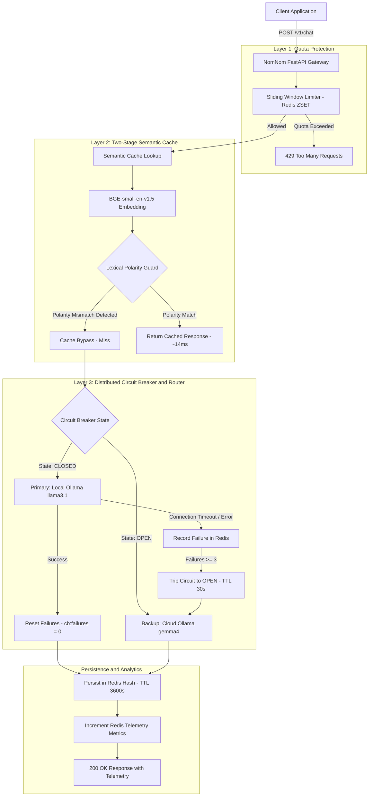
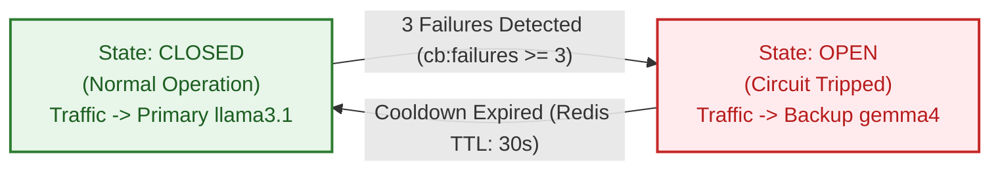
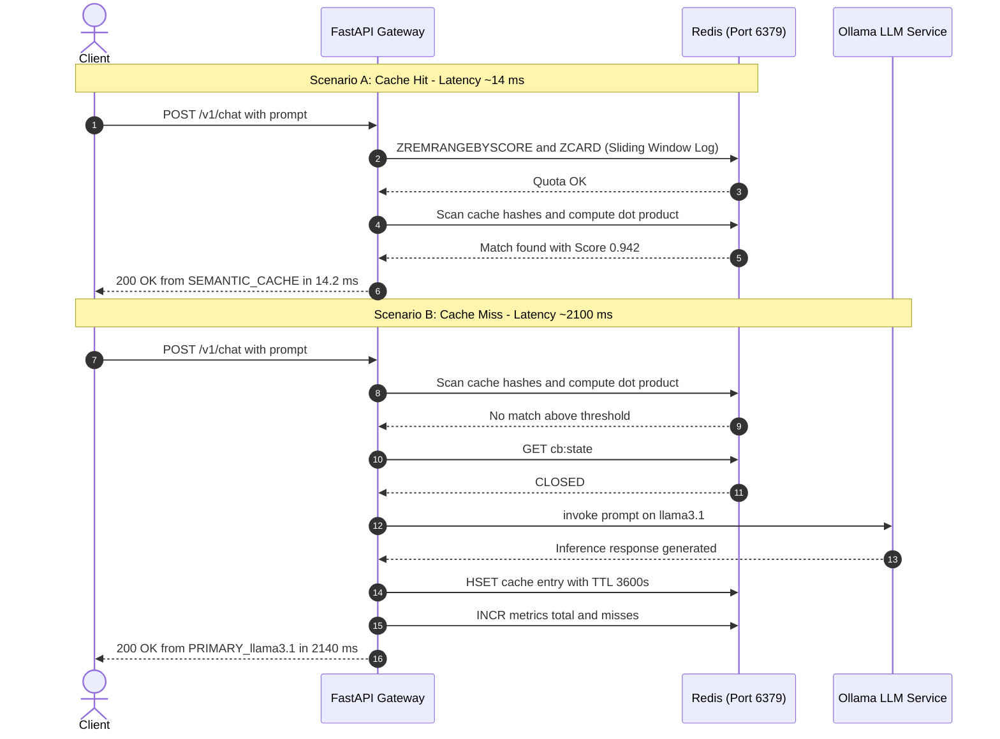

# NomNom: Resilient Distributed LLM Gateway

A high-performance, fault-tolerant LLM Gateway engineered with FastAPI, Redis, and LangChain. Built to reduce inference costs, enforce tenant quota protection, and guarantee high availability across local and cloud LLM endpoints.

---

## System Architecture



---

## Circuit Breaker State Machine

The distributed Circuit Breaker prevents cascading gateway latency during upstream inference outages. The state transitions are coordinated atomically across distributed nodes using Redis key-expiration semantics.



---

## Execution Lifecycle: Cache Hit vs. Cache Miss



---

## Key Technical Features

### 1. Sliding Window Log Rate Limiting
- Built on top of **Redis Sorted Sets (ZSET)** to eliminate the boundary spike vulnerability inherent to Fixed Window counters.
- Prunes expired timestamps (`ZREMRANGEBYSCORE`) and reads window cardinality (`ZCARD`) within a single Redis pipeline transaction to minimize network round-trip time (RTT).

### 2. Two-Stage Semantic Caching
- **Stage 1 (Vector Proximity):** Transforms prompts into 384-dimensional unit embeddings using `BAAI/bge-small-en-v1.5`. Because embeddings are pre-normalized, Cosine Similarity simplifies to a hardware-accelerated NumPy dot product.
- **Stage 2 (Lexical Polarity Guard):** Bi-encoder embedding models exhibit known blind spots for negation terms (`not`, `never`, `without`), frequently assigning similarity scores $> 0.88$ to opposing prompts (e.g., *"How to install"* vs *"How NOT to install"*). A sub-millisecond lexical XOR filter enforces polarity verification before any cached payload is returned.

### 3. Distributed Circuit Breaker & Fallback Router
- Prevents cascading gateway delays when upstream endpoints hang or fail (e.g., HTTP 410 model retirement, connection timeouts).
- Automatically trips to `OPEN` state upon 3 consecutive upstream failures, locking the dead endpoint for 30 seconds via Redis TTL keys and routing requests directly to the backup cloud model without latency penalty.

### 4. Real-Time Observability
- Exposes runtime telemetry via `/v1/stats`, including cache hit ratios, rate-limited request counts, and upstream circuit breaker statuses.

---

## Latency & Benchmark Metrics

| Request Path | Upstream Engine | Mean Latency | Latency Reduction |
| :--- | :--- | :--- | :--- |
| **Semantic Cache Hit** | Redis (Vector Dot Product) | **12 ms - 22 ms** | **99.3%** |
| **Primary Inference (Local)** | Ollama `llama3.1:latest` | **1800 ms - 3200 ms** | Baseline |
| **Fallback Inference (Cloud)** | Ollama `gemma4:31b-cloud` | **900 ms - 1600 ms** | Dynamic Failover |
| **Circuit Breaker Failover** | Redis State Bypass | **0 ms Overhead** | Immediate Routing |

---

## Project Structure

```text
nomnom/
├── redis_client.py       # Distributed Redis client with Docker/Local env config
├── rate_limiter.py       # Sliding Window Log limiter using Redis ZSET
├── semantic_cache.py     # 2-Stage Semantic Cache (BGE + Negation Guard)
├── circuit_breaker.py    # Multi-Model Router with Redis-backed Circuit Breaker
├── main.py               # FastAPI application (/v1/chat, /v1/stats, /health)
├── requirements.txt      # Locked production dependencies
├── Dockerfile            # Container build specification with preloaded model weights
├── docker-compose.yml    # Single-command orchestrator for Gateway and Redis
└── .gitignore            # Git exclusion rules
```

---

## Quickstart

### Option A: Running with Docker Compose (Recommended)

1. Clone the repository:
   ```bash
   git clone https://github.com/yourusername/nomnom.git
   cd nomnom
   ```

2. Launch the Gateway and Redis services:
   ```bash
   docker compose up --build
   ```

3. Open Swagger documentation at: `http://localhost:8000/docs`

---

### Option B: Local Python Development

1. Launch Redis container:
   ```bash
   docker run -d --name nomnom-redis -p 6379:6379 redis:latest
   ```

2. Install dependencies:
   ```bash
   pip install -r requirements.txt
   ```

3. Start Gateway:
   ```bash
   python main.py
   ```

---

## API Specification

### `POST /v1/chat`
Execute prompt with automated rate limiting, semantic caching, and model routing.

**Request Payload:**
```json
{
  "prompt": "How do I install Docker on Ubuntu Linux?",
  "client_id": "client_alpha"
}
```

**Response Payload (Cache Miss):**
```json
{
  "response": "Run: sudo apt update && sudo apt install docker.io",
  "source": "PRIMARY_llama3.1:latest",
  "similarity_score": null,
  "latency_ms": 2145.8,
  "rate_limit_remaining": 4
}
```

**Response Payload (Semantic Cache Hit):**
```json
{
  "response": "Run: sudo apt update && sudo apt install docker.io",
  "source": "SEMANTIC_CACHE",
  "similarity_score": 0.9339,
  "latency_ms": 14.1,
  "rate_limit_remaining": 3
}
```

### `GET /v1/stats`
Retrieve live telemetry recorded across the Redis cluster.

**Response Payload:**
```json
{
  "total_requests": 24,
  "cache_hits": 9,
  "cache_misses": 15,
  "cache_hit_ratio_percent": 37.5,
  "rate_limited_requests": 7,
  "circuit_breaker_state": "CLOSED"
}
```
